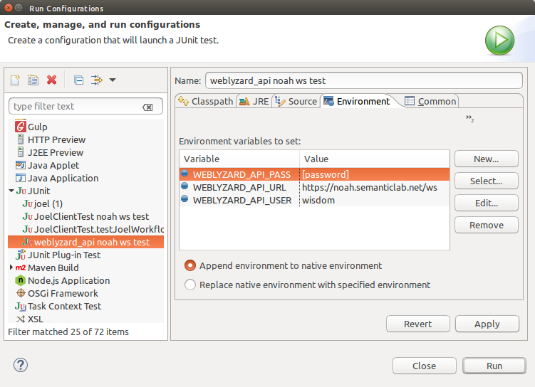

# The webLyzard API
[](https://www.travis-ci.org/weblyzard/weblyzard_api) (Java API)

Provides access to all webLyzard Web services through a python and java library.

Full Documentation is available at 

* Python: http://weblyzard-api.readthedocs.org/en/latest/
* Javadoc: http://javadoc.io/doc/com.weblyzard.api/weblyzard-api/0.1.0.1/


## Configuration

The API needs to know the URL, user and password used for the Web service. These data may be 

1. passed by a client at class initialization, or
2. automatically set by the means of the following environment variables:
  + `WEBLYZARD_API_URL`
  + `WEBLYZARD_API_USER`
  + `WEBLYZARD_API_PASS`

   this is also the preferred way for running unit tests.

The preferred way for setting these variables is using `.bash_profile`.

```sh
export WEBLYZARD_API_URL="https://noah.semanticlab.net/ws"
export WEBLYZARD_API_USER="user"
export WEBLYZARD_API_PASS="pass"
```

Do not set `WEBLYZARD_API_USER` and `WEBLYZARD_API_PASS` if your Web service does not require authentication.

If you have already set the variables using `.bash_profile`, when you run a script from the command line is also recommended to use:

```sh
source ~/.bash_profile
```

### Runtime Configuration for Eclipse 

To run the unit tests in eclipse, the environment variables have to be set in the runtime configuration: 




## Available interfaces:

The following interfaces are currently available for `weblyzard_api`:

+ **domain specificity:** document relevance in regard of a particular domain)
+ **Jeremia**: text pre-processing (pos tagger, dependency parser, sentence splitter, languag detection)
+ **Jesaja**: keyword extraction
+ **OpenRDF**: access OpenRDF linked open data repositories
+ **Recognize**: named entity recognition
+ **Sentiment Analysis**:

## Python API 

### dependencies

The following two dependencies might need to be installed manually: libxml and libxslt.

### running test for jeremia 

weblyzard_api/tests/python/client$ python test_jeremia.py "Ehre sei Gott!"


### Examples

Example scripts are available in the `example` directory.

+ `examples/keywords/compute-keywords.py` - example keywords and pre-processing script.

# Programming Guidelines

+ Required documentation for public methods
  + docstring explaining what the method does
  + a unit test demonstrating the method's usage in the wild.
+ commits must pass all unit tests
+ verify code quality for merge requests (`mvn sonar:sonar`)

To activate the java client debugging (logging requests / responses etc) set the environment variable **ENV_WEBLYZARD_API_DEBUG** to true: 

```
export WEBLYZARD_API_DEBUG="true"
```

## Deploying the maven artifacts 

Deploy to the private semanticlab maven repository: 

```
mvn deploy -Denvironment=semanticlab
```
The environment **semanticlab** is set as the default maven environment, so running 

```
mvn deploy
```
deploys to the private semanticlab repository. 


Deploying to the public mavencentral: 

```
mvn deploy -Denvironment=mavencentral
```


